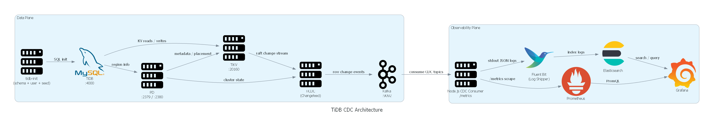

# Helfy – TiDB CDC Monitoring Stack

This project implements a complete end-to-end data platform using **TiDB**, **TiCDC**, **Kafka**, **Node.js**, **Prometheus**, **Elasticsearch**, and **Grafana**.

It captures all database changes (insert/update/delete), processes them in real time, exposes metrics, stores logs, and visualizes everything with dashboards.

The entire system runs locally using Docker Compose.

---

## Architecture (High Level)

- **TiDB Cluster** – PD + TiKV + TiDB (MySQL protocol)
- **TiCDC** – captures database changes
- **Kafka** – transports CDC events
- **Node.js Consumer** – processes events and exposes Prometheus metrics
- **Prometheus** – metrics collection
- **Elasticsearch + Filebeat** – centralized logs
- **Grafana** – dashboards (metrics + logs)
- **Smoke Test** – validates the full pipeline automatically


---

## Prerequisites

- Docker
- Docker Compose

---

## Run the Project

```bash
  docker-compose up -d --build
```

This single command will:

1. Start the TiDB cluster
2. Initialize database schema and users
3. Start Kafka
4. Start TiCDC and auto-create the CDC changefeed
5. Start the Node.js CDC consumer
6. Start Prometheus, Elasticsearch, Filebeat and Grafana
7. Run an automated smoke test validating the entire pipeline

---

## Services & URLs

| Service | URL |
|------|----|
| TiDB (MySQL) | `localhost:4000` |
| TiCDC API | `http://localhost:8300` |
| Kafka (external) | `localhost:9094` |
| Prometheus | `http://localhost:9090` |
| Grafana | `http://localhost:3000` |
| Elasticsearch | `http://localhost:9200` |
| Consumer metrics | `http://localhost:9102/metrics` |

### Grafana Credentials
- **User:** `admin`
- **Password:** `admin`

Dashboards are auto-provisioned on startup.

---

## Database

- Database name: `app`
- Tables:
    - `users`
    - `orders`

Schema, seed data, and default user creation are handled automatically on startup.

---

## CDC & Monitoring

- All `INSERT / UPDATE / DELETE` operations are captured by **TiCDC**
- Events are published to Kafka (`app_cdc` topic)
- Node.js consumer:
    - Logs every CDC event
    - Increments Prometheus counters:
      ```
      cdc_events_total{table, op}
      ```
- Grafana dashboards:
    - Raw CDC events (Elasticsearch)
    - 1-hour operation distribution pie chart (Prometheus)

---

## Smoke Test

A dedicated smoke test container runs automatically and verifies:

- TiDB, TiCDC, Kafka, Prometheus, Elasticsearch availability
- Database schema existence
- CDC pipeline functionality
- Consumer metrics increment
- Kafka event visibility

If any step fails, the test stops and reports the error.

---

## Run Smoke Test Again

```bash
  docker-compose rm -f smoke
  docker-compose up smoke
```

Then u can see the metrics in Grafana.


---

---

## Stop & Clean Up

```bash
  docker-compose down -v
```

Removes all containers, networks, and volumes.

---

## Notes

- Designed for local development and demonstration
- Single-broker Kafka and single-node Elasticsearch for simplicity
- All components are observable and verifiable
